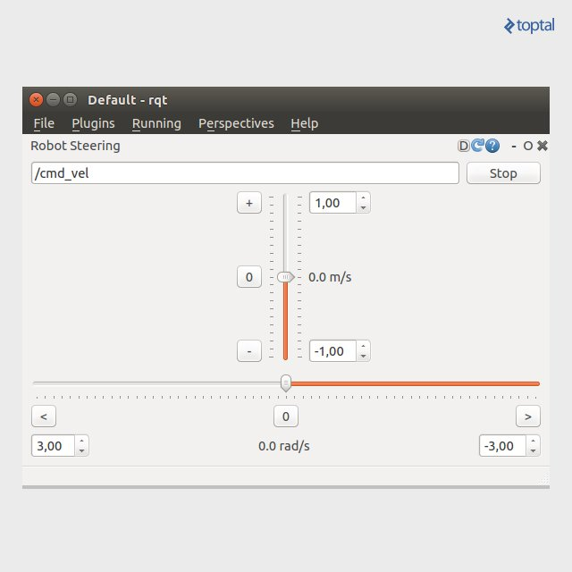

# Proyecto1
#  Implementación de un sistema de percepción para el reconocimiento de seres humanos utilizando el Robot Pepper en un ambiente simulado.

## Contexto

Con el desarrollo de la robótica social, la interacción entre humanos y robots viene teniendo cabida mas a menudo en ambientes en donde comúnmente solo poblaban
humanos. Aquí encontramos a robots utilizados para dar clases académicas a niños,robot que sirven de recepcionistas, entre otros. Para una correcta interacción social, el robot tiene que tener en cuenta algunas restricciones sociales, tales como, respetar un espacio adecuado con las personas (Proxémica), no tener movimientos bruscos cuando esta cerca de una persona, no pasar por en medio de un grupo de personas, etc.
Implementar estas restricciones en un robot hace más fácil su inserción a un ambiente comúnmente poblado por humanos. Por lo tanto, hace falta que el robot presente un buen desempeño a nivel de percepción ya que es de vital importancia el reconocer y distinguir a las personas de otros objetos inertes, esto con el fin de brindar al robot información adecuada de tal manera que integre en su accionar restricciones sociales

Toda la Implementacion fue hecha en ROS Melodic and Ubuntu 18.04.

### Creditos

**Autor: [Marcos Daza Guardamino],
**Asesor: [Dennis Barrios Aranibar]

**Affiliation: [Electrical and Electronics Engineering Department, School of Electronics and Telecommunications Engineering, Universidad Católica San Pablo, Arequipa-Peru]

---

## Citas 

El metodo YOLO esta descrito en el siguiente paper: [You Only Look Once: Unified, Real-Time Object Detection](https://arxiv.org/abs/1506.02640).

Las especificacion sobre el Robot Pepper se muestran en el siguiente link: [Pepper_Robot](http://wiki.ros.org/pepper)

## Instalacion e Implementacion del Robot Pepper

### Dependencias

Todo la implementacion se ejecuta bajo el Sistema Operativo Robotic Operating System ([ROS]), especificamente en ROS MELODIC. Por lo tanto, se necesita instalar el distro Melodic, el siguiente link lo ayudara con estos pasos. (http://wiki.ros.org/melodic/Installation/Ubuntu).

### Implementaciones
Para una correcta instalacion del robot Pepper se debe seguir los siguientes pasos:
 
 Instalar las prinipales Dependencias del Pepper
 
    $sudo apt-get install ros-melodic-pepper-meshes
    $sudo apt-get install ros-melodic-gazebo-ros-control
    $sudo apt-get install ros-melodic-moveit*
    $sudo apt-get install ros-melodic-tf2-sensor-msgs ros-melodic-ros-control ros-melodic-ros-controllers ros-melodic-gazebo-ros ros-melodic-gazebo-plugins ros-melodic-controller-manager python-wstool ros-melodic-gazebo*

  Crear la carpeta principal 
  
    mkdir -p pepper_sim_ws/src
    cd pepper_sim_ws/src
    
  Clonar los paquetes del Robot Pepper
  
      git clone -b correct_chain_model_and_gazebo_enabled https://github.com/awesomebytes/pepper_robot
      git clone -b simulation_that_works https://github.com/awesomebytes/pepper_virtual
      git clone https://github.com/awesomebytes/gazebo_model_velocity_plugin
      git clone https://github.com/pal-robotics/ddynamic_reconfigure_python

  Compilar el programa
  
     cd ..
     catkin_make
  
  Luego de haber realizado es necesario modificar el archivo "bashrc"
  
    gedit ~/.bashrc
    export ROS_PEPPER_SIM_WS=<path_to_your_pepper_sim_ws_folder>
  
#### Creacion de Ambiente de Simulacion
  Debido a que este proyecto esta orientado a un ambiente poblado por humanos, es necesario poner al robot en un mapa con personas.
 
  Se hace uso del mapa ISCA MUSEUM , el cual viene precagado en gazebo 9. Se busca este mapa en la pestana "Insert" para despues salvarlo y guardarlo en la carpeta
 
    ~/pepper_sim_ws/src/pepper_virtual/pepper_gazebo_plugin/worlds
    
   Modificamos el launch: Abrimos el archivo ubicado en 
 
    /pepper_sim_ws/src/pepper_virtual/pepper_gazebo_plugin/launch
     $gedit pepper_gazebo_plugin_in_office_CPU.launch

   Luego modificamos el argumento tal y como se ve en la linea siguiente, este paso se hace con el fin de llamar al mundo ISCA MUSEUM cada vez que ejecutemos nuestro programa.  
 
    <arg name="world_name" value="$(find pepper_gazebo_plugin)/worlds/museum.world"/>

   Finalmente guardamos los cambios con el nombre "pepper_gazebo_plugin_museum.launch"
   De la misma forma como se agrego el mundo ISCA MUSEUM se puede agregar los avatar (Personas) en el mundo, los cuales puedes ser ubicados de la manera que el usuario guste.
A continuacion, se va a lanzar o ejecutar al robot Pepper en el mundo ISCA MUSEUM junto con las Personas. 

    $roslaunch pepper_gazebo_plugin pepper_gazebo_plugin_museum.launch
    
### Teleoperacion del Robot Pepper     
   Rqt es una herramienta GUI principal para ROS. Este plugins que pueden ser configurado en cualquier configuración visual y cualquier número de vistas predefinidas. Para empezar ejecutamos el plugin Robot Steering. Lo que obtenemos es dos deslizadores, que representan la moción lineal y rotacional que queremos que tenga nuestro robot. En la parte superior del plugin, vemos una caja de texto con `/cmd_vel`. Alli pondremos `pepper/cmd_vel`. Representa el nombre del tema al que va dirigida la publicación.
   
    rosrun rqt_robot_steering rqt_robot_steering
    
  

## Instalacion e Implementacion de YOLO para la Deteccion de Personas
 YOLO es básicamente un algoritmo de detección de objetos, es una red convolucional el cual predice múltiples cuadros delimitados. Yolo usa características de una imagen para predecir cada cuadro comparándolos con las clases que posee. YOLO divide una imagen en s x s celdas. En las que cada celda se encargara de predecir un objeto. Si el centro de ese objeto se encuentra en una celda de la cuadricula, esa celda será la responsable de la detección.
 
 La informacion para YOLO se tomo de (https://github.com/Intelligent-Quads/iq_tutorials/blob/master/docs/intro_to_yolo.md)
 
 ### Implementacion de YOLO en ROS Melodic
 Primeramente se crea el directorio en donde se descargara YOLO, puede ser una nueva carpeta o sobre la carpeta `pepper_sim_ws`
 
    sudo apt-get install -y gcc-6
    mkdir -p catkin_ws/src
    cd ~/catkin_ws/src/
 
 #### Instalacion de Darknet_ros 
 
    git clone --recursive https://github.com/leggedrobotics/darknet_ros.git 
    
 Para maximizar el rendimiento, asegúrese de compilar en modo de lanzamiento. Puede especificar el tipo de compilación configurando o utilizando las herramientas de línea de comandos de Catkin
 
    catkin_make -DCMAKE_BUILD_TYPE=Release
 
 Darknet en la CPU es rápido (aproximadamente 1,5 segundos en una CPU Intel Core i7-6700HQ a 2,60 GHz × 8), pero es 500 veces más rápido en la GPU. Para eso se tiene que tener una GPU Nvidia y ademas instalar CUDA. CUDA es una plataforma de computación paralela y un modelo de interfaz de programación de aplicaciones (API) creado por Nvidia.
 
     sudo apt install nvidia-cuda-toolkit
     
 #### Descargar Pesos (weight)
   Los yolo-voc.weights y tiny-yolo-voc.weights se descargan automáticamente en el archivo CMakeLists.txt. Si se necesita descargarlos nuevamente, vaya a la carpeta de weight y descargue los dos pesos previamente entrenados del conjunto de datos de COCO:
 
      cd catkin_workspace/src/darknet_ros/darknet_ros/yolo_network_config/weights/
      wget http://pjreddie.com/media/files/yolov2.weights
      wget http://pjreddie.com/media/files/yolov2-tiny.weights
 
 #### Utilice sus propios objetos de detección
  Para utilizar sus propios objetos de detección, debe proporcionar sus pesos y su archivo cfg dentro de los directorios:
  
         catkin_workspace/src/darknet_ros/darknet_ros/yolo_network_config/weights/
         catkin_workspace/src/darknet_ros/darknet_ros/yolo_network_config/cfg/
  
  Además, se necesita crear un archivo de configuración para ROS donde define los nombres de los objetos de detección. Debe incluirlo dentro de: 
  
       catkin_workspace/src/darknet_ros/darknet_ros/config/
  
  Luego, el archivo `launch`, debe apuntar a su nuevo archivo de `config` en :
  
      <rosparam command="load" ns="darknet_ros" file="$(find darknet_ros)/config/your_config_file.yaml"/>
      
  Para que YOLO ROS: Detección de objetos, se ejecute con su robot en tiempo real para ROS, deberá adaptar algunos parámetros. Estos son específicamente los archivos de parámetros en `config` y el archivo `launch`.    
  
  #### Nodos 
  YOLO utiliza las medidas de la cámara para detectar objetos previamente aprendidos en los fotogramas. En cuanto a parámetros relacionados con ROS, se puede cambiar los nombres y otros parámetros de los publishers y subscribers. Ademas en `ros.yaml` se puede elegir que detectara YOLO.
  
    darkned_ros/config/ros.yaml
  
  ##### Topicos Subscribed 
  Para adaptar Yolo al Robot Pepper necesitamos cambiar el topico de la camara predeterminada por YOLO:
  
   * **`/camera_reading`** ([/pepper/camera/front/image_raw])
   
  Las medidas de la cámara.
  
  ##### Topicos Published
  * **`object_detector`** ([/darknet_ros/found_object])
  
    Publica el número de objetos detectados.

* **`bounding_boxes`** ([/darknet_ros/bounding_boxes])

    Publica una matriz de cuadros delimitadores que proporciona información sobre la posición y el tamaño del cuadro delimitador en coordenadas de píxeles.

* **`detection_image`** ([/darknet_ros/detection_image])

    Publica una imagen de la imagen de detección que incluye el bounding boxes.

Finalmente, luego de haber ejecutado el Pepper en un mundo, ejecutar YOLO 

     roslaunch darknet_ros darknet_ros.launch
  
  
  
